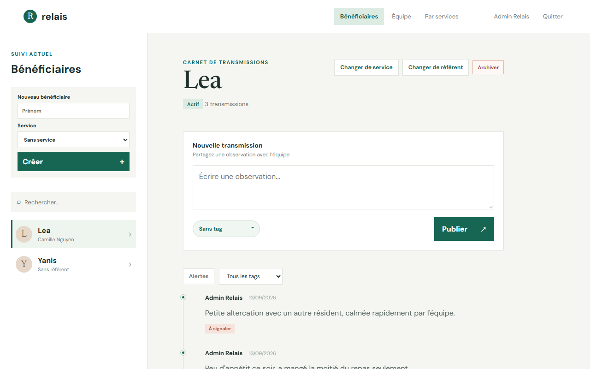
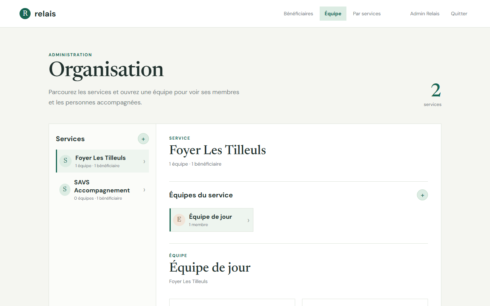

# Relais

[](https://github.com/WDFAllan/relaisNote/actions/workflows/ci.yml)

Carnet de transmission numérique pour les équipes éducatives et sociales (foyers, services d'accompagnement) : les éducateurs et référents y notent des observations sur les personnes accompagnées, se transmettent l'information au fil des relèves, et repèrent en un coup d'œil ce qui doit être signalé.

## Aperçu

| Carnet de transmissions | Organisation (admin) |
|---|---|
|  |  |

<details>
<summary>Écran de connexion</summary>


</details>

## Fonctionnalités

- **Transmissions** : chaque bénéficiaire a un carnet où l'équipe publie des observations horodatées, taggées (comportement, santé, repas/sommeil, activité, point positif, ou **à signaler** pour les alertes).
- **Organisation** : les bénéficiaires sont rattachés à un service et à un référent ; les services regroupent des équipes, elles-mêmes composées d'éducateurs et de référents.
- **Rôles** : Administrateur (gestion complète), Référent (crée des bénéficiaires, gère leur service/référent, archive), Éducateur (consulte et publie des transmissions).
- **Archivage plutôt que suppression** : un bénéficiaire quitté est archivé, pas effacé — l'historique de transmissions reste consultable.
- **Auth JWT** avec déconnexion automatique à l'expiration du token (pas besoin d'attendre un appel API en échec).
- **Journal d'audit** sur les actions sensibles (création, archivage, changement de service/référent).

## Stack technique

**Backend** — .NET 9 / ASP.NET Core, EF Core + PostgreSQL, JWT, architecture en 3 projets :
```
src/
├── Relais.Domain/          # Entités métier, services (logique pure, testée)
├── Relais.Infrastructure/  # DbContext EF Core, migrations
├── Relais.Api/              # Contrôleurs REST, auth JWT, Swagger
└── Relais.Domain.Tests/     # Tests unitaires (xUnit)
```

**Frontend** — React 19 + TypeScript + Vite :
```
frontend/src/
├── api.ts                 # Client fetch, gestion du token JWT
├── types.ts                # Types partagés
├── components/              # Une vue par domaine (bénéficiaires, services, équipe)
└── App.tsx                  # État applicatif et routage entre vues
```

**Déploiement** — Docker Compose (API + PostgreSQL + reverse proxy Caddy en HTTPS auto).

**CI** — GitHub Actions : build + tests .NET, lint + typecheck + build frontend, à chaque push/PR sur `main`.

## Démarrer en local

### Backend + base de données

```bash
docker compose up --build
```

Crée le premier compte administrateur (une seule fois) :

```bash
curl -X POST http://localhost/api/auth/setup \
  -H "Content-Type: application/json" \
  -d '{"email":"admin@relais.local","motDePasse":"UnMotDePasseSolide123!","prenom":"Admin","nom":"Relais"}'
```

Swagger disponible sur `http://localhost/swagger`.

### Frontend

```bash
cd frontend
npm install
npm run dev
```

L'application est servie sur `http://localhost:5173` (le proxy Vite redirige `/api` vers le backend).

### Tests

```bash
dotnet test src/Relais.sln       # backend
cd frontend && npm run lint && npm run build   # frontend (lint + typecheck)
```

## Variables d'environnement (`.env`)

```
DB_PASSWORD=un_mot_de_passe_solide
JWT_SECRET=une_chaine_longue_et_aleatoire
RELAIS_DOMAIN=localhost
ASPNETCORE_ENVIRONMENT=Development
SWAGGER_ENABLED=true
```
